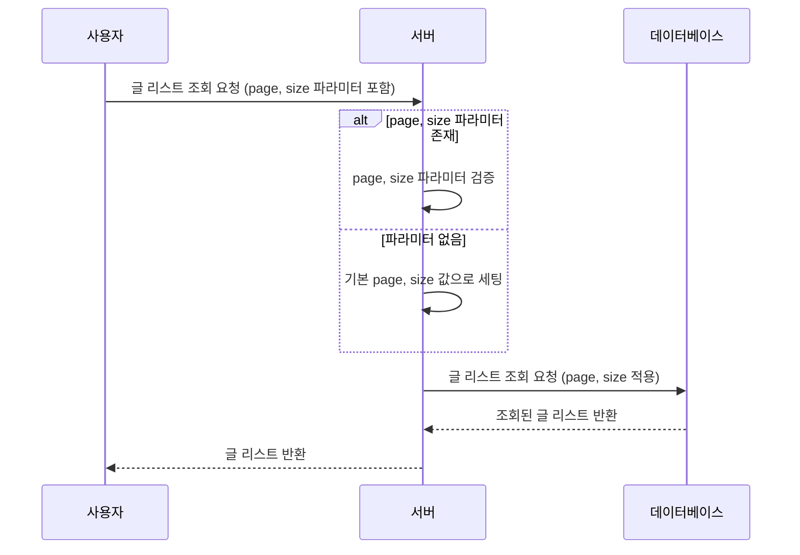

## 글 리스트 조회하기 시퀀스 다이어그램

```mermaid
sequenceDiagram
    participant User as 사용자
    participant Server as 서버
    participant DB as 데이터베이스
    
    User->>Server: 글 리스트 조회 요청 (page, size 파라미터 포함)
    alt page, size 파라미터 존재
        Server->>Server: page, size 파라미터 검증
    else 파라미터 없음
        Server->>Server: 기본 page, size 값으로 세팅
    end
    Server->>DB: 글 리스트 조회 요청 (page, size 적용)
    DB-->>Server: 조회된 글 리스트 반환
    Server-->>User: 글 리스트 반환
```