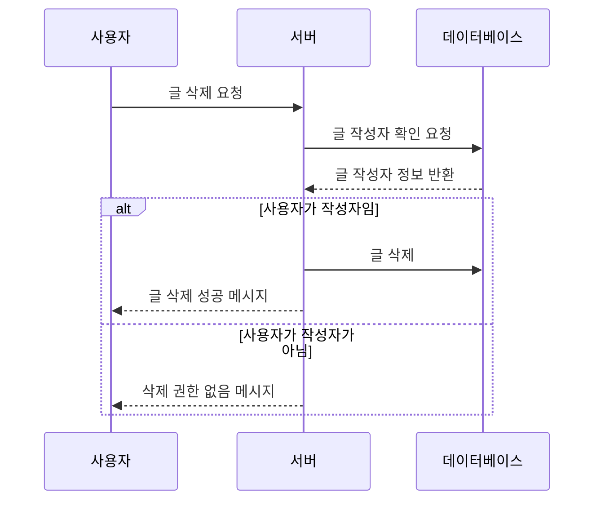

## 글 삭제하기 시퀀스 다이어그램

```mermaid
sequenceDiagram
    participant User as 사용자
    participant Server as 서버
    participant DB as 데이터베이스
    
    User->>Server: 글 삭제 요청
    Server->>DB: 글 작성자 확인 요청
    DB-->>Server: 글 작성자 정보 반환
    alt 사용자가 작성자임
        Server->>DB: 글 삭제 
        Server-->>User: 글 삭제 성공 메시지
    else 사용자가 작성자가 아님
        Server-->>User: 삭제 권한 없음 메시지
    end
```