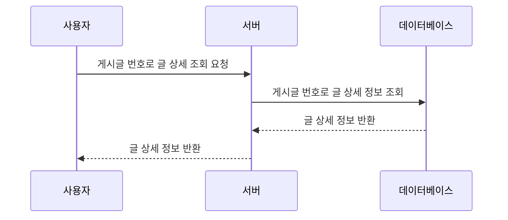

## 글 상세 조회하기 시퀀스 다이어그램

```mermaid
sequenceDiagram
    participant User as 사용자
    participant Server as 서버
    participant DB as 데이터베이스
    
    User->>Server: 게시글 번호로 글 상세 조회 요청
    Server->>DB: 게시글 번호로 글 상세 정보 조회
    DB-->>Server: 글 상세 정보 반환
    Server-->>User: 글 상세 정보 반환
```