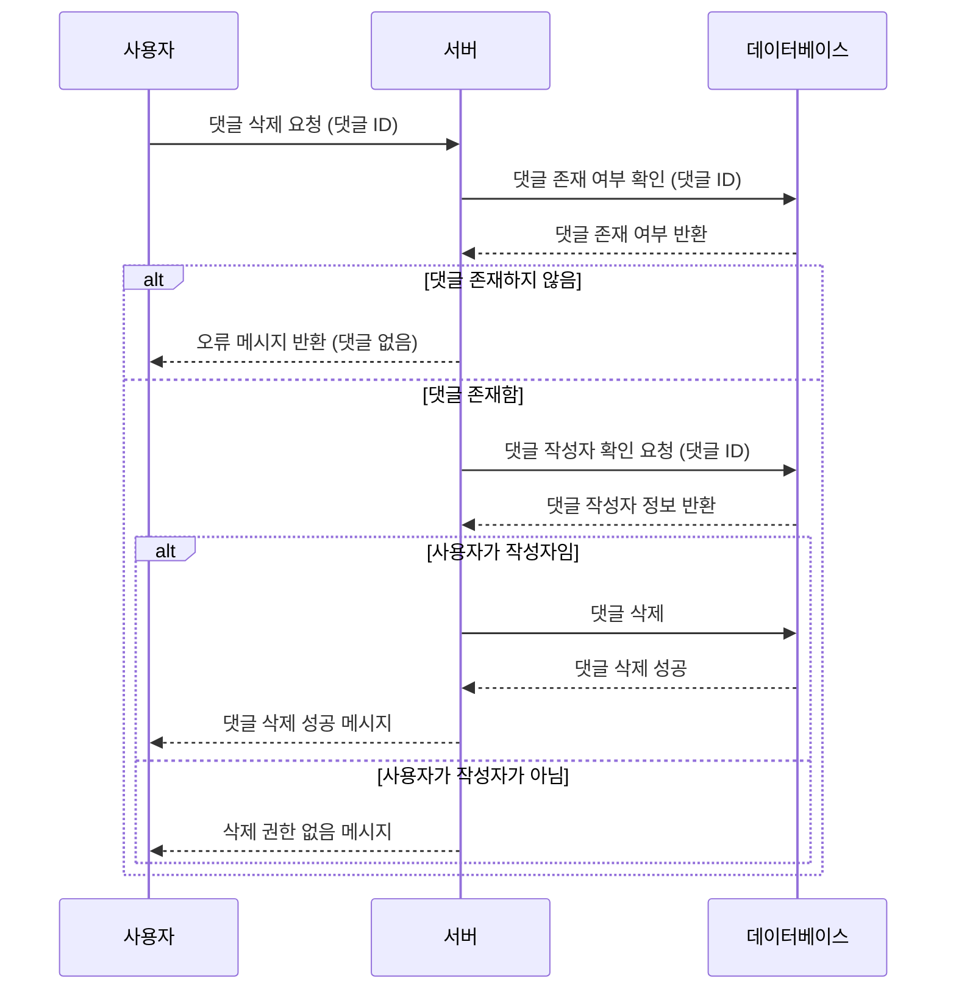

## 댓글 삭제하기 시퀀스 다이어그램

```mermaid
sequenceDiagram
    participant User as 사용자
    participant Server as 서버
    participant DB as 데이터베이스
    
    User->>Server: 댓글 삭제 요청 (댓글 ID)
    Server->>DB: 댓글 존재 여부 확인 (댓글 ID)
    DB-->>Server: 댓글 존재 여부 반환
    alt 댓글 존재하지 않음
        Server-->>User: 오류 메시지 반환 (댓글 없음)
    else 댓글 존재함
        Server->>DB: 댓글 작성자 확인 요청 (댓글 ID)
        DB-->>Server: 댓글 작성자 정보 반환
        alt 사용자가 작성자임
            Server->>DB: 댓글 삭제
            DB-->>Server: 댓글 삭제 성공
            Server-->>User: 댓글 삭제 성공 메시지
        else 사용자가 작성자가 아님
            Server-->>User: 삭제 권한 없음 메시지
        end
    end
```