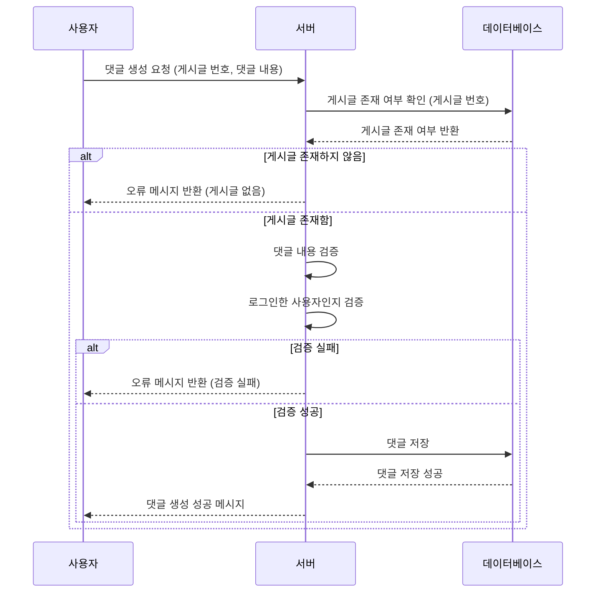

## 댓글 생성하기 시퀀스 다이어그램

```mermaid
sequenceDiagram
    participant User as 사용자
    participant Server as 서버
    participant DB as 데이터베이스
    
    User->>Server: 댓글 생성 요청 (게시글 번호, 댓글 내용)
    Server->>DB: 게시글 존재 여부 확인 (게시글 번호)
    DB-->>Server: 게시글 존재 여부 반환
    alt 게시글 존재하지 않음
        Server-->>User: 오류 메시지 반환 (게시글 없음)
    else 게시글 존재함
        Server->>Server: 댓글 내용 검증
        Server->>Server: 로그인한 사용자인지 검증
        alt 검증 실패
            Server-->>User: 오류 메시지 반환 (검증 실패)
        else 검증 성공
            Server->>DB: 댓글 저장
            DB-->>Server: 댓글 저장 성공
            Server-->>User: 댓글 생성 성공 메시지
        end
    end
```