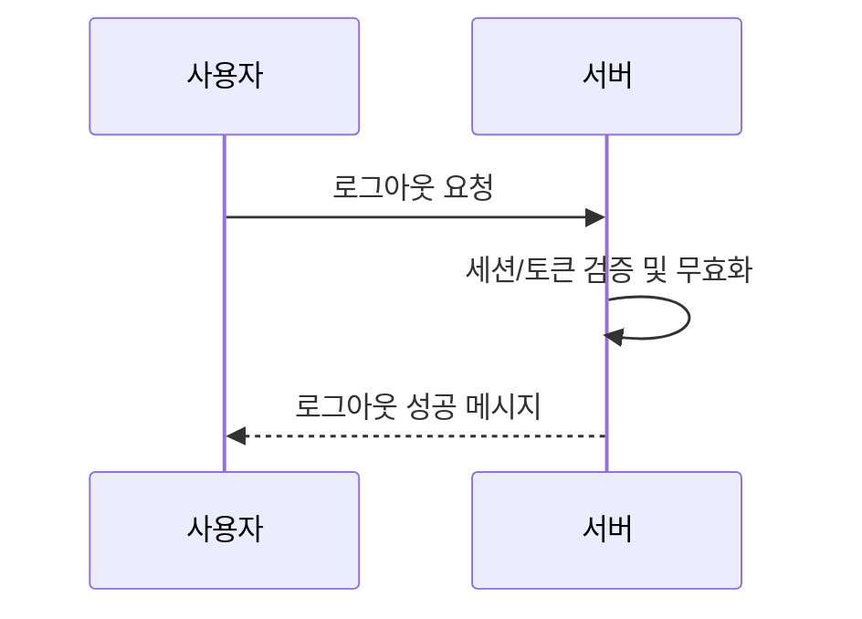

## 로그아웃 시퀀스 다이어그램

```mermaid
sequenceDiagram
    participant User as 사용자
    participant Server as 서버
    
    User->>Server: 로그아웃 요청
    Server->>Server: 세션/토큰 검증 및 무효화
    Server-->>User: 로그아웃 성공 메시지
```