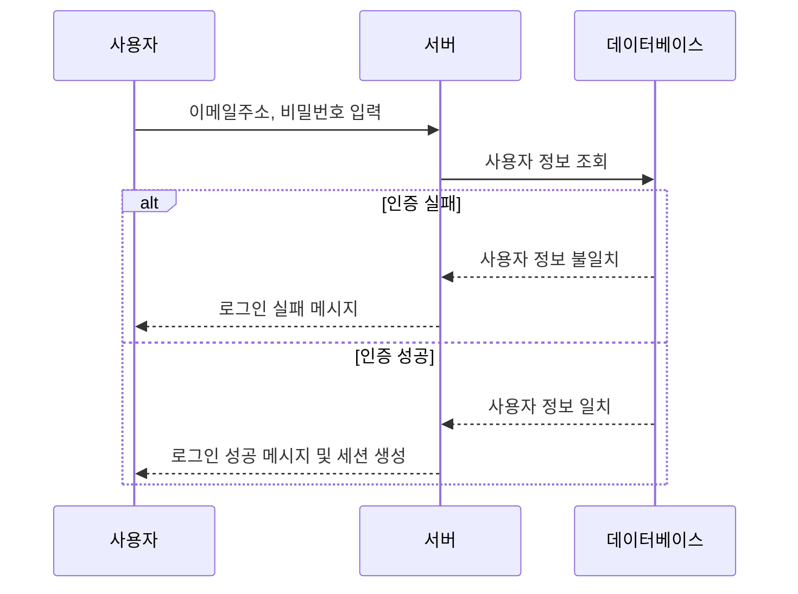

## 로그인 시퀀스 다이어그램

```mermaid
sequenceDiagram
    participant User as 사용자
    participant Server as 서버
    participant DB as 데이터베이스
    
    User->>Server: 이메일주소, 비밀번호 입력
    Server->>DB: 사용자 정보 조회
    alt 인증 실패
        DB-->>Server: 사용자 정보 불일치
        Server-->>User: 로그인 실패 메시지
    else 인증 성공
        DB-->>Server: 사용자 정보 일치
        Server-->>User: 로그인 성공 메시지 및 세션 생성
    end
```