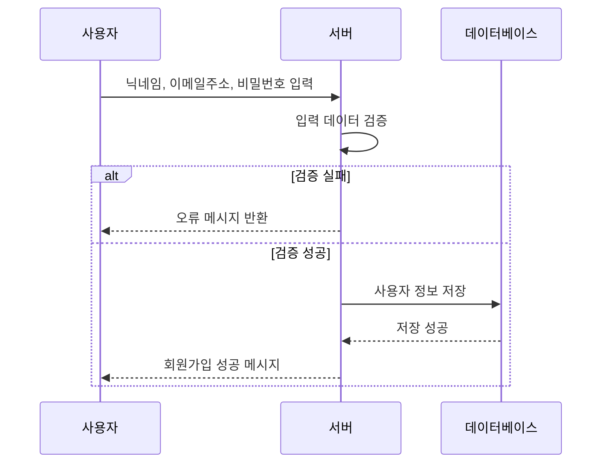

## 회원가입 시퀀스 다이어그램

```mermaid
sequenceDiagram
    participant User as 사용자
    participant Server as 서버
    participant DB as 데이터베이스
    
    User->>Server: 닉네임, 이메일주소, 비밀번호 입력
    Server->>Server: 입력 데이터 검증
    alt 검증 실패
        Server-->>User: 오류 메시지 반환
    else 검증 성공
        Server->>DB: 사용자 정보 저장
        DB-->>Server: 저장 성공
        Server-->>User: 회원가입 성공 메시지
    end
```

